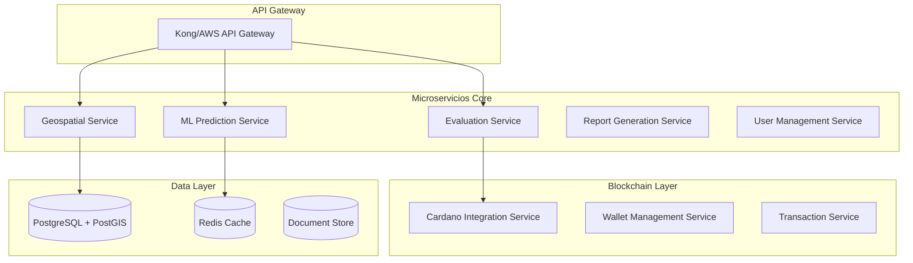
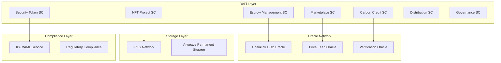
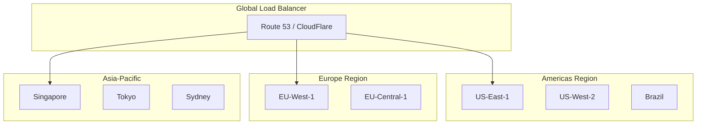

# 🌍 ROADMAP DE TRANSFORMACIÓN MUNDIAL - PROYECTO NUWA
## Arquitectura Empresarial y Escalabilidad Global

---

## 📊 ANÁLISIS DE BRECHA ACTUAL

### 🎯 Estado Actual (Lo que funciona)
```
✅ Frontend Next.js básico
✅ APIs REST simples (/health, /api/status)
✅ Demos interactivos
✅ UI responsive
✅ Simulación Cardano wallet
✅ Métricas estáticas
```

### 📋 Estado Documentado (Fase 1 del DDI)
```
🟡 Backend ML + Geoespacial (Python)
🟡 PostgreSQL + PostGIS (AWS RDS)
🟡 Procesamiento satelital (Sentinel-2/Landsat)
🟡 Modelos ML para CO2
🟡 Generación informes PDF
🟡 Registro blockchain básico
```

### 🚀 Visión Mundial (Fase 2 del DDI)
```
🔴 7 Smart Contracts especializados
🔴 Tokenización completa (NFTs, Security, Utility)
🔴 Marketplace descentralizado
🔴 Oráculos (Chainlink/API3)
🔴 IPFS + KYC/AML
🔴 Gestión fondos automatizada
```

---

## 🗺️ ROADMAP DE TRANSFORMACIÓN (24 MESES)

### **FASE 0: CONSOLIDACIÓN BASE** ⏱️ *2 meses*

#### Objetivo: Completar Fase 1 documentada
- **Backend de Evaluación Real**
  - ✅ PostgreSQL + PostGIS en AWS RDS
  - ✅ Motor Python con GDAL, Rasterio, Shapely
  - ✅ APIs Sentinel-2 y Landsat integradas
  - ✅ Modelos ML (scikit-learn, TensorFlow)
  - ✅ Generador de informes PDF automatizados

- **Frontend Avanzado**
  - ✅ Carga de polígonos GIS (KML, GeoJSON, Shapefile)
  - ✅ Mapas interactivos (Leaflet, Mapbox)
  - ✅ Dashboard de gestión de proyectos
  - ✅ Sistema de scoring A/B/C

- **Blockchain Básica**
  - ✅ Registro de evaluaciones en Cardano
  - ✅ Hash de informes inmutables
  - ✅ Wallet integration mejorada

**💰 Inversión:** $100K | **👥 Equipo:** 4 devs + 1 data scientist + 1 GIS specialist

---

### **FASE 1: ARQUITECTURA EMPRESARIAL** ⏱️ *4 meses*

#### Objetivo: Infraestructura escalable y microservicios



#### **🏗️ Arquitectura de Microservicios**

**1. Evaluation Service** (Puerto 3001)
```typescript
// Funcionalidades:
- Orquestación de evaluaciones
- Gestión de flujos de trabajo
- Scoring ambiental/financiero
- Integración con otros servicios
```

**2. Geospatial Service** (Puerto 3002)
```python
# Funcionalidades:
- Procesamiento de polígonos
- Integración APIs satelitales
- Análisis de cobertura terrestre
- Cálculos de biomasa
```

**3. ML Prediction Service** (Puerto 3003)
```python
# Funcionalidades:
- Modelos de captura CO2
- Análisis predictivo
- Clasificación de riesgo
- Validación de modelos
```

**4. Report Generation Service** (Puerto 3004)
```node
// Funcionalidades:
- Templates PDF dinámicos
- Generación de gráficos
- Agregación de datos
- Distribución de informes
```

**5. User Management Service** (Puerto 3005)
```typescript
// Funcionalidades:
- Autenticación/Autorización
- Gestión de perfiles
- Control de acceso
- Auditoría de usuarios
```

#### **🔧 Stack Tecnológico Empresarial**

**Backend:**
- **API Gateway:** Kong o AWS API Gateway
- **Microservicios:** Node.js (TypeScript) + Python (FastAPI)
- **Message Queue:** Apache Kafka o AWS SQS
- **Cache:** Redis Cluster
- **Monitoring:** Prometheus + Grafana
- **Logging:** ELK Stack (Elasticsearch, Logstash, Kibana)

**Base de Datos:**
- **Principal:** PostgreSQL 15 + PostGIS (Multi-AZ)
- **Cache:** Redis Cluster (ElastiCache)
- **Documentos:** MongoDB Atlas o AWS DocumentDB
- **Time Series:** InfluxDB para métricas

**Infraestructura:**
- **Cloud:** AWS (Multi-región: US-East, EU-West, Asia-Pacific)
- **Containers:** Docker + Kubernetes (EKS)
- **Load Balancer:** AWS Application Load Balancer
- **CDN:** CloudFront
- **Secrets:** AWS Secrets Manager

**💰 Inversión:** $200K | **👥 Equipo:** 6 devs + 1 DevOps + 1 arquitecto

---

### **FASE 2: BLOCKCHAIN AVANZADA** ⏱️ *6 meses*

#### Objetivo: Smart Contracts y tokenización completa

#### **🔗 Smart Contracts en Cardano (Aiken)**

```aiken
// 1. NFT Project Registration
validator nft_project_registration {
  mint(redeemer: ProjectRedeemer, context: ScriptContext) -> Bool {
    // Validar metadata IPFS
    // Verificar ownership
    // Registrar proyecto único
  }
}

// 2. Security Token Emission
validator security_token_emission {
  spend(datum: SecurityTokenDatum, redeemer: SecurityRedeemer, context: ScriptContext) -> Bool {
    // KYC/AML compliance
    // Investment limits
    // Regulatory approval
  }
}

// 3. Escrow Fund Management
validator escrow_fund_management {
  spend(datum: EscrowDatum, redeemer: EscrowRedeemer, context: ScriptContext) -> Bool {
    // Milestone verification
    // Oracle validation
    // Automated fund release
  }
}

// 4. Carbon Credit Utility Tokens
validator carbon_credit_tokens {
  mint(redeemer: CarbonRedeemer, context: ScriptContext) -> Bool {
    // CO2 verification
    // Third-party validation
    // Retirement tracking
  }
}

// 5. Marketplace Liquidity
validator marketplace_liquidity {
  spend(datum: MarketplaceDatum, redeemer: MarketplaceRedeemer, context: ScriptContext) -> Bool {
    // Order matching
    // Price discovery
    // Settlement automation
  }
}

// 6. Benefit Distribution
validator benefit_distribution {
  spend(datum: BenefitDatum, redeemer: BenefitRedeemer, context: ScriptContext) -> Bool {
    // Proportional distribution
    // Automatic calculations
    // Tax compliance
  }
}

// 7. Governance Contract
validator governance_contract {
  spend(datum: GovernanceDatum, redeemer: GovernanceRedeemer, context: ScriptContext) -> Bool {
    // Voting mechanisms
    // Proposal management
    // Execution triggers
  }
}
```

#### **🏛️ Arquitectura DeFi Completa**



#### **💼 Funcionalidades DeFi**

**1. Tokenización de Proyectos**
- NFTs únicos por proyecto con metadata IPFS
- Representación inmutable de activos ambientales
- Trazabilidad completa del ciclo de vida

**2. Inversión Tokenizada**
- Security Tokens regulados (compliance automático)
- Múltiples rondas de inversión
- Distribución automática de beneficios

**3. Créditos de Carbono como Utility Tokens**
- Tokens ERC-721 para créditos únicos
- Verificación por oráculos externos
- Retirement y burning automático

**4. Marketplace Descentralizado**
- AMM (Automated Market Maker) para liquidez
- Order book híbrido
- Price discovery transparente

**💰 Inversión:** $400K | **👥 Equipo:** 4 blockchain devs + 2 auditores + 1 compliance

---

### **FASE 3: ESCALABILIDAD MUNDIAL** ⏱️ *6 meses*

#### Objetivo: Infraestructura global y compliance multi-jurisdiccional

#### **🌍 Arquitectura Multi-Región**



#### **🏗️ Infraestructura de Escala Mundial**

**1. Multi-Cloud Strategy**
```yaml
Primary: AWS (75%)
  - Compute: EKS, Lambda, Fargate
  - Storage: S3, EFS, EBS
  - Database: RDS, DynamoDB, ElastiCache
  - Network: VPC, CloudFront, Route 53

Secondary: Google Cloud (15%)
  - Disaster Recovery
  - Earth Engine API (Satellite data)
  - BigQuery (Analytics)

Tertiary: Azure (10%)
  - Compliance (Gov regions)
  - AI/ML Services
  - Backup & Archive
```

**2. Performance Targets**
```
🎯 Latency: <200ms global
🎯 Availability: 99.99% uptime
🎯 Throughput: 10,000 req/sec
🎯 Scalability: Auto-scale 0-1000 instances
🎯 Data Processing: 1TB satelital/day
```

**3. Security & Compliance**
```
🔒 SOC 2 Type II certification
🔒 ISO 27001 compliance
🔒 GDPR/CCPA data protection
🔒 Financial services regulatory compliance
🔒 Zero-trust network architecture
```

#### **📊 Monitoreo y Observabilidad**

**Métricas de Negocio:**
- Proyectos evaluados/día
- Volumen tokenización (USD)
- Transacciones blockchain/segundo
- Retorno de inversión promedio
- Créditos de carbono comercializados

**Métricas Técnicas:**
- Latencia p99 por región
- Error rate < 0.1%
- Database query performance
- Blockchain confirmation times
- IPFS retrieval speed

**💰 Inversión:** $600K | **👥 Equipo:** 3 SRE + 2 security + 1 compliance officer

---

### **FASE 4: ECOSISTEMA COMPLETO** ⏱️ *6 meses*

#### Objetivo: Plataforma integral con partners y expansión

#### **🤝 Integraciones Estratégicas**

**1. Verificadoras Ambientales**
- Verra (VCS)
- Gold Standard
- Climate Action Reserve
- Plan Vivo
- American Carbon Registry

**2. Exchanges de Carbono**
- Chicago Mercantile Exchange (CME)
- ICE Futures
- European Energy Exchange (EEX)
- Xpansiv CBL Markets

**3. Instituciones Financieras**
- Bancos de inversión verde
- Fondos de pensiones ESG
- Aseguradoras climáticas
- Family offices sostenibles

**4. Proveedores de Datos**
- NASA Earth Data
- European Space Agency (Copernicus)
- Planet Labs
- Maxar Technologies
- Climate data providers

#### **🔗 APIs y SDKs Públicos**

```typescript
// Nuwa SDK para desarrolladores
import { NuwaSDK } from '@nuwa/sdk';

const nuwa = new NuwaSDK({
  apiKey: 'your-api-key',
  network: 'mainnet', // or 'testnet'
  region: 'us-east-1'
});

// Evaluación de proyectos
const evaluation = await nuwa.projects.evaluate({
  polygon: geoJsonPolygon,
  projectType: 'forestry',
  timeframe: '30-years'
});

// Tokenización
const nft = await nuwa.tokens.createProjectNFT({
  projectId: evaluation.id,
  metadata: ipfsHash
});

// Marketplace
const listing = await nuwa.marketplace.listToken({
  tokenId: nft.id,
  price: '1000_ADA',
  currency: 'ADA'
});
```

#### **📱 Aplicaciones Móviles**

**1. Nuwa Mobile (iOS/Android)**
- Evaluación de campo con GPS
- Cámara ML para identificación de especies
- Wallet Cardano integrada
- Marketplace móvil

**2. Nuwa Verifier**
- App para verificadores de campo
- Captura de evidencia con blockchain
- Reportes automáticos
- Geolocalización certificada

#### **🎯 Métricas de Adopción Mundial**

**KPIs Objetivo (Año 2):**
- 🌍 **Presencia:** 50+ países activos
- 📊 **Proyectos:** 10,000+ evaluados
- 💰 **Volumen:** $500M+ tokenizado
- 🏢 **Partners:** 100+ verificadoras
- 👥 **Usuarios:** 50,000+ activos
- 🌱 **CO2:** 10M+ tons certificadas

**💰 Inversión:** $800K | **👥 Equipo:** 8 developers + 4 business development

---

## 💰 RESUMEN FINANCIERO TOTAL

| Fase | Duración | Inversión | Equipo | ROI Esperado |
|------|----------|-----------|---------|--------------|
| **Fase 0** | 2 meses | $100K | 6 personas | Base sólida |
| **Fase 1** | 4 meses | $200K | 8 personas | Escalabilidad |
| **Fase 2** | 6 meses | $400K | 7 personas | Monetización |
| **Fase 3** | 6 meses | $600K | 6 personas | Global reach |
| **Fase 4** | 6 meses | $800K | 12 personas | Market leadership |

**💎 TOTAL:** $2.1M en 24 meses para transformación mundial completa

---

## 🎯 HITOS CRÍTICOS Y RIESGOS

### **🏆 Hitos de Éxito**

**Q1 2025:**
- ✅ Backend ML completamente funcional
- ✅ 100+ evaluaciones reales procesadas
- ✅ PostgreSQL + PostGIS en producción

**Q2 2025:**
- ✅ Arquitectura microservicios desplegada
- ✅ 1,000+ evaluaciones/mes
- ✅ API pública beta lanzada

**Q3 2025:**
- ✅ Smart contracts auditados y desplegados
- ✅ Primer proyecto tokenizado
- ✅ $1M+ en TVL (Total Value Locked)

**Q4 2025:**
- ✅ Marketplace funcionando
- ✅ 10+ países con usuarios activos
- ✅ Compliance regulatorio múltiple

**Q1-Q2 2026:**
- ✅ Ecosistema completo operativo
- ✅ $100M+ volumen anual
- ✅ Liderazgo de mercado establecido

### **⚠️ Riesgos Principales**

**Técnicos:**
- 🔴 Complejidad de smart contracts
- 🟡 Escalabilidad de blockchain Cardano
- 🟡 Integración de oráculos confiables

**Regulatorios:**
- 🔴 Compliance en múltiples jurisdicciones
- 🟡 Cambios en regulaciones DeFi
- 🟡 Estándares de tokenización

**De Mercado:**
- 🟡 Adopción de tecnología blockchain
- 🟡 Competencia con soluciones centralizadas
- 🟡 Volatilidad en mercados de carbono

**Mitigación:**
- Auditorías de seguridad continuas
- Compliance legal proactivo
- Partnerships estratégicos
- Desarrollo ágil e iterativo

---

## 🚀 PRÓXIMOS PASOS INMEDIATOS

### **Semana 1-2:**
1. **Arquitectura Detallada**
   - Diagramas técnicos específicos
   - Especificaciones de microservicios
   - Plan de migración de datos

2. **Equipo y Recursos**
   - Recruitment de desarrolladores clave
   - Setup de infraestructura AWS
   - Configuración de herramientas DevOps

3. **Prototipo Backend**
   - PostgreSQL + PostGIS setup
   - API básica para evaluaciones
   - Integración satelital inicial

### **Mes 1:**
1. **MVP Funcional**
   - Motor de evaluación completo
   - Frontend conectado a backend real
   - Primeras evaluaciones reales

2. **Fundación Técnica**
   - CI/CD pipeline
   - Monitoring y logging
   - Security hardening

3. **Validación de Mercado**
   - Beta testing con usuarios reales
   - Feedback y iteración
   - Métricas de performance

---

## 📞 CONTACTO Y SIGUIENTE FASE

¿Te gustaría que profundice en alguna fase específica o que desarrollemos los diagramas técnicos detallados para comenzar la implementación?

**Opciones de profundización:**
1. 🏗️ Arquitectura de microservicios detallada
2. 🔗 Especificaciones de smart contracts
3. 📊 Setup de infraestructura AWS
4. 💼 Plan de compliance regulatorio
5. 📱 Diseño de APIs públicas

**¡Nuwa está listo para convertirse en la plataforma líder mundial de tokenización ambiental!** 🌍✨