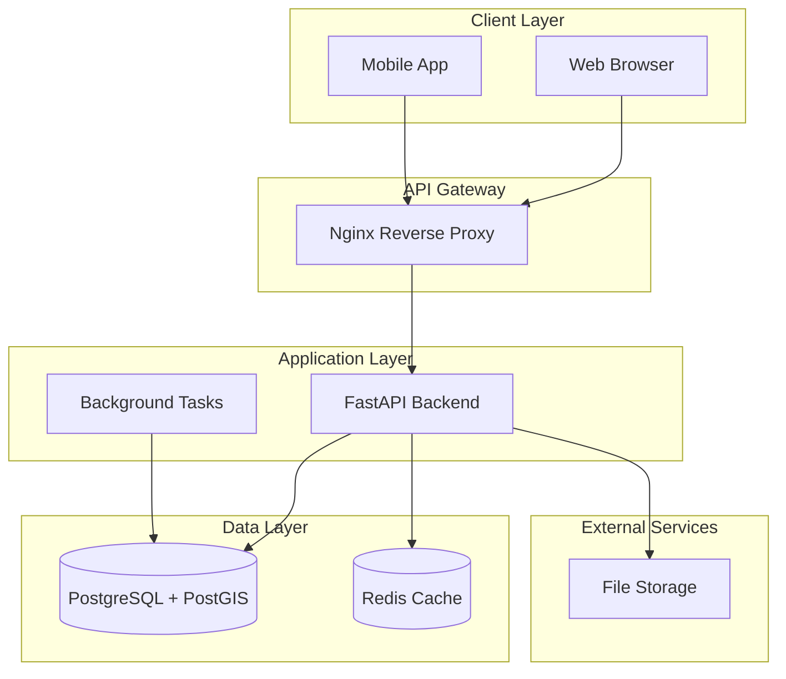

# 🏃‍♂️ PLAN DETALLADO POR SPRINTS - PROYECTO NUWA
## Transformación de Concepto a Plataforma Mundial de Clase Enterprise

---

## 📋 **OVERVIEW DEL PLAN DE SPRINTS**

### **FASE 0: CONSOLIDACIÓN BASE** (2 meses - 8 sprints)
```
Sprint 1: Backend de Evaluación + PostgreSQL Setup    [INICIANDO AHORA]
Sprint 2: APIs Geoespaciales + Integración Satelital
Sprint 3: Modelos ML para CO2 + Scoring System  
Sprint 4: Generador de Informes + Frontend Avanzado
Sprint 5: Blockchain Integration + Wallet Management
Sprint 6: Testing + Performance Optimization
Sprint 7: Security Hardening + Deployment Pipeline
Sprint 8: Documentation + Beta Launch
```

---

## 🎯 **SPRINT 1: BACKEND DE EVALUACIÓN CORE** 
### **Duración:** 1 semana (7 días)
### **Fecha:** Comenzando AHORA - [Semana del 23-29 Septiembre 2024]

#### **🎯 OBJETIVOS DEL SPRINT 1**
- ✅ Crear arquitectura backend robusta con Python/FastAPI
- ✅ Configurar PostgreSQL + PostGIS en producción
- ✅ Implementar APIs básicas para evaluación de proyectos
- ✅ Establecer estructura de base de datos completa
- ✅ Crear sistema de gestión de polígonos geoespaciales

#### **📦 DELIVERABLES**
1. **Backend API funcional** con FastAPI
2. **Base de datos** PostgreSQL + PostGIS configurada
3. **Modelos de datos** para proyectos y evaluaciones
4. **API endpoints** básicos implementados
5. **Sistema de validación** de polígonos GIS

#### **🛠️ STACK TÉCNICO SPRINT 1**
```python
# Backend
- FastAPI (Python 3.11+)
- SQLAlchemy + Alembic (ORM + Migrations)
- Pydantic (Validation)
- PostgreSQL 15 + PostGIS 3.4
- Redis (Cache)
- Uvicorn (ASGI Server)

# Geospatial
- Shapely (Geometric operations)
- GeoPandas (Data manipulation)
- Rasterio (Raster processing)
- PyProj (Coordinate transformations)
- GDAL/OGR (Geospatial data abstraction)

# Infrastructure  
- Docker + Docker Compose
- SQLite (Development)
- PostgreSQL (Production)
```

---

## 📅 **SPRINT 1: CRONOGRAMA DIARIO DETALLADO**

### **DÍA 1: SETUP DE ARQUITECTURA** 
**🎯 Objetivo:** Crear estructura base del backend

#### **Tareas del Día 1:**
- [ ] **Setup del proyecto Python** (30 min)
- [ ] **Configuración FastAPI básica** (45 min)
- [ ] **Docker + Docker Compose setup** (60 min)
- [ ] **Estructura de directorios** (15 min)
- [ ] **Requirements y dependencias** (30 min)

#### **Entregables Día 1:**
```
nuwa-backend/
├── app/
│   ├── __init__.py
│   ├── main.py              # FastAPI app
│   ├── config.py            # Configuration
│   ├── database.py          # DB connection
│   └── models/              # SQLAlchemy models
├── requirements.txt         # Dependencies
├── Dockerfile              # Container config
├── docker-compose.yml      # Multi-service setup
└── README.md               # Setup instructions
```

### **DÍA 2: DATABASE SETUP** 
**🎯 Objetivo:** PostgreSQL + PostGIS funcionando

#### **Tareas del Día 2:**
- [ ] **PostgreSQL + PostGIS Docker setup** (45 min)
- [ ] **SQLAlchemy configuration** (30 min)
- [ ] **Alembic migrations setup** (45 min)
- [ ] **Database models creation** (90 min)
- [ ] **Connection testing** (30 min)

#### **Entregables Día 2:**
```sql
-- Tables created:
- users              # User management
- projects           # Project registry  
- evaluations        # Evaluation results
- polygons           # Geospatial data
- scoring_results    # ML scoring outcomes
- reports           # Generated reports
```

### **DÍA 3: MODELOS DE DATOS**
**🎯 Objetivo:** Estructura de datos completa

#### **Tareas del Día 3:**
- [ ] **User model + authentication** (60 min)
- [ ] **Project model** (45 min)
- [ ] **Evaluation model** (60 min)
- [ ] **Geospatial polygon model** (75 min)
- [ ] **Relationships y constraints** (60 min)

### **DÍA 4: APIs BÁSICAS**
**🎯 Objetivo:** Endpoints fundamentales

#### **Tareas del Día 4:**
- [ ] **Authentication endpoints** (90 min)
- [ ] **Project CRUD endpoints** (90 min)
- [ ] **File upload for polygons** (90 min)
- [ ] **Basic validation** (60 min)

### **DÍA 5: PROCESAMIENTO GEOESPACIAL**
**🎯 Objetivo:** Lógica GIS básica

#### **Tareas del Día 5:**
- [ ] **Polygon validation service** (90 min)
- [ ] **Coordinate system handling** (60 min)
- [ ] **Area calculation** (45 min)
- [ ] **GeoJSON processing** (75 min)

### **DÍA 6: TESTING Y VALIDACIÓN**
**🎯 Objetivo:** Asegurar calidad

#### **Tareas del Día 6:**
- [ ] **Unit tests setup** (60 min)
- [ ] **API integration tests** (90 min)
- [ ] **Database tests** (60 min)
- [ ] **Performance testing** (90 min)

### **DÍA 7: DOCUMENTACIÓN Y DEPLOY**
**🎯 Objetivo:** Preparar para producción

#### **Tareas del Día 7:**
- [ ] **API documentation (Swagger)** (45 min)
- [ ] **Setup instructions** (30 min)
- [ ] **Environment configuration** (45 min)
- [ ] **Production deployment** (90 min)
- [ ] **Sprint review** (30 min)

---

## 🎯 **DEFINICIÓN DE "DONE" - SPRINT 1**

### **Criterios de Aceptación:**
- ✅ Backend FastAPI corriendo en puerto 8000
- ✅ PostgreSQL + PostGIS aceptando conexiones
- ✅ API endpoints respondiendo correctamente
- ✅ Swagger documentation accesible
- ✅ Docker containers funcionando
- ✅ Tests pasando al 100%
- ✅ Polígonos GeoJSON procesándose correctamente

### **Métricas de Éxito:**
- 🎯 **Response Time:** < 200ms para endpoints básicos
- 🎯 **Test Coverage:** > 80%
- 🎯 **API Uptime:** 99.9% durante testing
- 🎯 **Documentation:** 100% endpoints documentados

---

## 🏗️ **ARQUITECTURA TÉCNICA SPRINT 1**



---

## 📂 **ESTRUCTURA DE PROYECTO SPRINT 1**

```
nuwa-backend/
├── app/
│   ├── __init__.py
│   ├── main.py                 # FastAPI application
│   ├── config.py               # Settings & configuration
│   ├── database.py             # DB connection & session
│   │
│   ├── models/                 # SQLAlchemy models
│   │   ├── __init__.py
│   │   ├── user.py
│   │   ├── project.py
│   │   ├── evaluation.py
│   │   └── geometry.py
│   │
│   ├── schemas/                # Pydantic schemas
│   │   ├── __init__.py
│   │   ├── user.py
│   │   ├── project.py
│   │   └── evaluation.py
│   │
│   ├── api/                    # API endpoints
│   │   ├── __init__.py
│   │   ├── deps.py             # Dependencies
│   │   ├── auth.py
│   │   ├── projects.py
│   │   └── evaluations.py
│   │
│   ├── services/               # Business logic
│   │   ├── __init__.py
│   │   ├── geospatial.py
│   │   ├── validation.py
│   │   └── scoring.py
│   │
│   └── utils/                  # Utilities
│       ├── __init__.py
│       ├── security.py
│       └── helpers.py
│
├── alembic/                    # Database migrations
├── tests/                      # Test suite
├── requirements.txt            # Python dependencies  
├── Dockerfile                  # Container definition
├── docker-compose.yml          # Multi-service setup
└── README.md                   # Documentation
```

---

## 📋 **SPRINT 2-8: PREVIEW DE PRÓXIMOS SPRINTS**

### **SPRINT 2: APIs Geoespaciales + Satelital** (Semana 2)
- 🛰️ Integración con Sentinel-2 API
- 📡 Procesamiento de imágenes satelitales
- 🗺️ Análisis de cobertura terrestre
- 📊 Cálculos de biomasa básicos

### **SPRINT 3: Modelos ML + Scoring** (Semana 3)  
- 🤖 Modelos de captura de CO2
- 🎯 Sistema de scoring A/B/C
- 📈 Predicciones temporales
- 🔬 Validación científica

### **SPRINT 4: Generador de Informes** (Semana 4)
- 📄 Templates PDF dinámicos
- 📊 Gráficos automáticos
- 🗂️ Gestión de reportes
- 💾 Storage y distribución

### **SPRINT 5: Blockchain Integration** (Semana 5)
- ⛓️ Cardano wallet integration
- 🔐 Smart contract básico
- 📝 Registro de evaluaciones
- 🔍 Consulta blockchain

### **SPRINT 6-8: Testing + Deploy + Documentation** (Semanas 6-8)
- ✅ Testing completo
- 🚀 Production deployment  
- 📚 Documentación técnica
- 🎉 Beta launch

---

## 🚀 **COMENZANDO SPRINT 1 AHORA**

### **Configuración Inmediata:**
1. **Workspace Setup** (5 min)
2. **FastAPI Backend** (15 min)
3. **PostgreSQL Container** (10 min)
4. **First API Endpoint** (15 min)

### **¿Listo para comenzar?**
- ✅ Crear estructura de proyecto
- ✅ Configurar FastAPI básico
- ✅ Setup PostgreSQL + PostGIS
- ✅ Primer endpoint funcional

**¡Vamos a transformar Nuwa en una plataforma de clase mundial! 🌍✨**